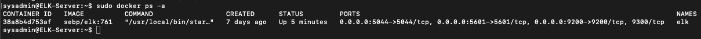
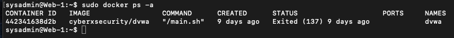
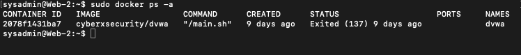
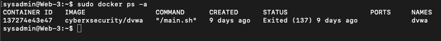
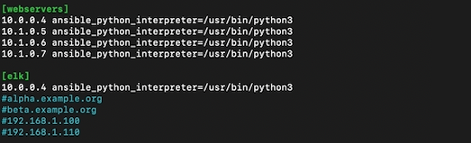

## Automated ELK Stack Deployment

The files in this repository were used to configure the network depicted below.

These files have been tested and used to generate a live ELK deployment on Azure. They can be used to either recreate the entire deployment pictured above. Alternatively, select portions of the YAML file may be used to install only certain pieces of it, such as Filebeat.

These documents contain the following details:
- Description of the Topology
- Access Policies
- ELK Configuration
  - Beats in Use
  - Machines Being Monitored
- How to Use the Ansible Build

### Description of the Topology

The main purpose of this network is to expose a load-balanced and monitored instance of DVWA, the D*mn Vulnerable Web Application.

Load balancing ensures that the application will be highly available, in addition to restricting access to the network.

- Load balancers defend an organization against Digital Denial of Service (DDoS) attacks by helping servers move data efficiently, optimizing the use of application delivery resources, and preventing server overloads by spreading the load evenly between multiple servers.
- The advantage of a jump box is that it provides a single point of entry and exit within the network, securing and configuring the internal network from the external network.

Integrating an ELK server allows users to easily monitor the vulnerable VMs for changes to the network and system configuration.

- Filebeat monitors the log files or locations that are specified, collects log events, and forwards them to either Elasticsearch or Logstash. Filebeat consists of two main components: inputs and harvesters. The Harvester is responsible for reading the content of a single file, line by line, and sending the content to the output. An input is responsible for managing the harvesters and finding all sources to read from.
- Metricbeat takes the metrics and statistics that it collects and ships them to the output that you specify, such as Elasticsearch or Logstash. Metricbeat helps you monitor your servers by collecting metrics from the system and services running on the server. 

The configuration details of each machine may be found below.
_Note: Use the [Markdown Table Generator](http://www.tablesgenerator.com/markdown_tables) to add/remove values from the table_.

| Name       	| Function                  | IP Address 	| Operating System     		
|-------------|---------------------------|-------------|----------------------		
| Jump Box   	| Gateway                   | 10.1.0.4, 20.25.4.16  | Linux (Ubuntu 18.04)  	
| Web-1      	| Traffic Monitoring        | 10.1.0.5   	          | Linux (Ubuntu 18.04) 		
| Web-2      	| Traffic Monitoring        | 10.1.0.6            	| Linux (Ubuntu 18.04) 		
| Web-3      	| Traffic Monitoring        | 10.1.0.7   	          | Linux (Ubuntu 18.04) 		
| ELK Server 	| Data Analytics Aggregation| 10.0.0.4, 137.117.11.6| Linux (Ubuntu 18.04) 

### Access Policies

The machines on the internal network are not exposed to the public Internet. 

Only the Jump box machine can accept connections from the Internet. Access to this machine is only allowed from the following IP addresses:
- 193.56.117.137

Machines within the network can only be accessed by the Jump box provisioner with the corresponding ansible container at IP address 10.1.0.4.

A summary of the access policies in place can be found in the table below.

| Name       	| Publicly Accessable | Allowed IP Addresses     |
|-------------|---------------------|--------------------------|
| Jump Box   	| Yes                 | 193.56.117.137           |
| Web-1      	| No                  | 10.1.0.4                 |
| Web-2      	| No                  | 10.1.0.4                 |
| Web-3      	| No                  | 10.1.0.4                 |    
| ELK Server 	| Yes                 | 193.56.117.137:5601      |

### Elk Configuration

Ansible was used to automate configuration of the ELK machine. No configuration was performed manually, which is advantageous because this reduces time to deployment time per container, allows for scalable deployment, and eliminates manual configuration entry errors.

The playbook implements the following tasks:

- Configures the Elk VM with Docker.

- Installs the following modules within the container: docker.io, pip3, and docker python module. 

- Configures sysctl modules, increases system memory, downloads and launches a docker ELK container using the published ports 5601:5601, 9200:9200, and 5044:5044.

- Configures the Docker to start automatically on boot.  

The following screenshot displays the result of running `docker ps` after successfully configuring the ELK instance.

-ELK_Server:

Web-1:

-Web-2:

-Web-3:

### Target Machines & Beats
This ELK server is configured to monitor the following machines:
- Web-1: 10.1.0.5
- Web-2: 10.1.0.6
- Web-3: 10.1.0.7

We have installed the following Beats on these machines:
- filebeat (version 7.6.2) and metricbeat (version 7.6.1) are installed on the ELK-Server, Web-1, Web-2, and Web-3.

These Beats allow us to collect the following information from each machine:
- Filebeat collects log events and forwards them to either Elasticsearch or Logstash.Metricbeat takes the metrics and statistics that it collects and ships them to the output that you specify, such as Elasticsearch or Logstash. Metricbeat helps you monitor your servers by collecting metrics from the system and services running on the server.

### Using the Playbook
In order to use the playbooks, you will need to have an Ansible control node already configured. Assuming you have such a control node provisioned: 

SSH into the control node and follow the steps below:
- Copy the filebeat configuration and metricbeat config file to the ansible container.
- Update the configuration files to include the correct IP address of the ELK Server @ 10.0.0.4:5601 and 10.0.0.4:9200
- Run the filebeat and metricbeat playbooks, and navigate to the proper URL of the ELK Server GUI (Kibana: http://<public-ELK-IP-address>:5601/app/kibana) to check that the installation worked as expected.

- The two playbook files you will need to be concerned with are filebeat-playbook.yml and metricbeat-playbook.yml. Both will need to be copied to the /etc/ansible/roles directory within your ansible container.

- You will need to update filebeat-config.yml and metricbeat-config.yml, specifically on lines 1106 and 1806, adding the ELK private IP address of 10.0.0.4 so that the kibana monitor modules are deployed properly on the ELK server.
   - Line 1106- update the hosts IP address to your ELK server’s private IP address:
          hosts: ["10.0.0.4:9200"]
          username: "elastic"
          password: "changeme" 
  
   - Line 1806- perform the same action as above:
   setup.kibana:
          host: "10.0.0.4:5601" 

-  You will also need to update the hosts file on the ansible container to show proper targets for deployment and monitoring for the ELK server.
    

  
 - Once all of the configurations have been set, run the following commands from the ansible container:
   - ansible-playbook filebeat-playbook.yml
   - ansible-playbook metricbeat-playbook.yml
  

